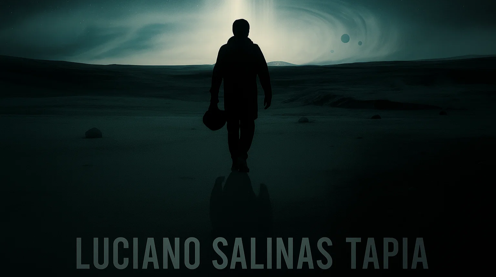

# 🫵 ¡Hola! Soy Luciano Salinas Tapia  
### 💻 Analista Programador | Desarrollador Web & Móvil  

> “El hombre que emplea su talento con diligencia busca no solo su propio beneficio, sino que, sin saberlo, promueve el bienestar de toda la sociedad.”
> — *Adam Smith, La Riqueza de las Naciones (1776)*

---

## 🧑🏻‍🚀 Sobre mí  
Soy **Luciano Salinas Tapia**, estudiante de **Analista Programador en INACAP Valparaíso**, apasionado por la creación de soluciones tecnológicas que aporten valor real.  
Me especializo en **desarrollo web con React y Django**, y tengo experiencia práctica en **aplicaciones móviles con Kotlin** y **Firebase**.  
Busco iniciar mi carrera profesional en un entorno donde pueda aprender, aportar y seguir creciendo como desarrollador.

---

## 🚀 Tecnologías que utilizo  

**Lenguajes:**  

**Frameworks y Librerías:**  

**Bases de Datos y Herramientas:**  

---

## 📂 Proyecto destacado  
### [ImpulsaMente Web](https://github.com/LuSpace1/impulsamente-web)
Desarrollo de una **plataforma web** que conecta profesionales de psicología y metodología académica con usuarios que buscan apoyo especializado.  
Stack principal: **React**, **Django**, **PostgreSQL**, **API RESTful**, **Jira**, **Confluence**.  

---

## 📊 GitHub Stats  
  

---

## 🌍 Conecta conmigo  
📍 Viña del Mar, Chile  
📧 [contacto.lucianosalinas@gmail.com](mailto:contacto.lucianosalinas@gmail.com)  
🔗 [GitHub - LuSpace1](https://github.com/LuSpace1)  
💼 [LinkedIn - Próximamente](#)

---

⭐ *Gracias por visitar mi perfil. Estoy abierto a oportunidades para prácticas o mi primer empleo en desarrollo de software.*

