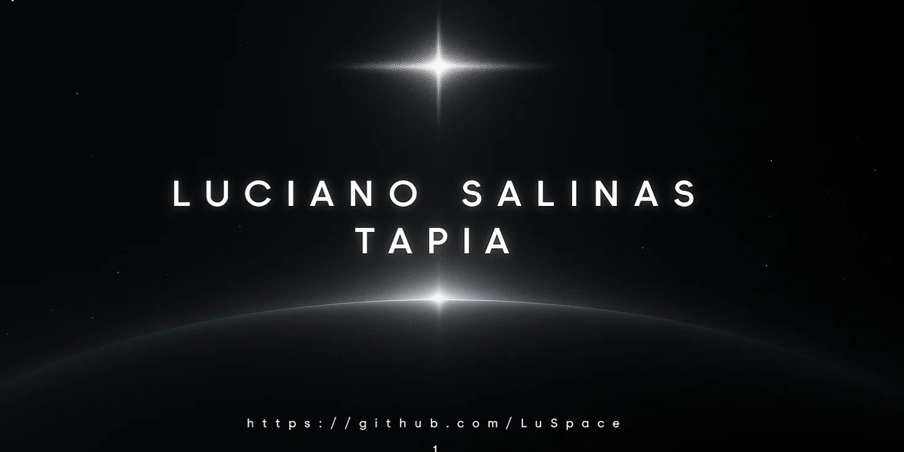

<h1>
🫵 ¡Hola! Soy Luciano Salinas Tapia

  
  

</h1>

### 💻 Analista Programador | Desarrollador Web & Móvil  

> “El hombre que emplea su talento con diligencia busca no solo su propio beneficio, sino que, sin saberlo, promueve el bienestar de toda la sociedad.”  
> — *Adam Smith, La Riqueza de las Naciones (1776)*

---

## 🎯 Disponibilidad Profesional  
Actualmente me encuentro en **búsqueda de mi primer trabajo profesional** en el área de desarrollo de software, con el objetivo de incorporarme a un **equipo de trabajo real**, participar en **proyectos productivos** y **adquirir experiencia profesional sólida**, aportando desde el primer día con mis conocimientos técnicos, buenas prácticas y actitud de aprendizaje continuo.

---

## 🧑🏻‍🚀 Sobre mí  
Hola 👋 Soy **Luciano Salinas Tapia**, **Analista Programador titulado** y estudiante de **Ingeniería en Informática**.  

**Desarrollador Full Stack** con un enfoque especial en Backend usando **Django y FastAPI** y **React** para el Frontend. Cuento con experiencia en proyectos de alto impacto para clientes y proyectos personales utilizando metodologías ágiles, buenas practicas y sobre todo un enfoque especial en el producto y su viabilidad.

Me gusta definirme como un "Builder": un ingeniero con mentalidad de founder que prioriza el impacto al negocio y el alto ownership. Soy proactivo en la resolución de problemas técnicos y estratégicos, asegurando que cada línea de codigo genere valor real.

---

## 🚀 Tecnologías que utilizo

### Lenguajes

### Frameworks & Librerías

### Bases de Datos & Backend Services

### Herramientas & Gestión (y otros)

---

## 🏗️ Práctica Profesional – Sistemas de Gestión Empresarial  

### GeoAtacama Consultores Ltda. · vía ISAMAX Consultorías  
Desarrollo de un **sistema web de gestión empresarial** enfocado en la administración de inventarios, operaciones y recursos humanos.

Participé en el desarrollo **backend y frontend**, implementando funcionalidades CRUD, validaciones, lógica de negocio y persistencia de datos en bases de datos relacionales, alineadas a procesos reales de la organización.

**Stack:** Django, JavaScript, SQL, HTML/CSS, Git, Trello, MySQL  
🔗 https://www.sicgeoatacama.cl/

---

### House Construcción y Servicios SpA · vía ISAMAX Consultorías  
Participación en el desarrollo de un **sistema web interno** para **House Construcción y Servicios SpA**, orientado a optimizar la gestión operativa y administrativa del negocio.

Contribuí en el desarrollo de **módulos funcionales** para:
- Organización y asignación de **turnos**
- Gestión de **finanzas**
- Administración y seguimiento de **obras**

**Stack:** Django, JavaScript, SQL, HTML/CSS, Git, Trello, MySQL  
🔗 https://www.houseconstruccion.cl/

---

## 📂 Proyecto destacado  

### ImpulsaMente Web  
🔗 https://github.com/LuSpace1/impulsamente-web  
🔗 https://impulsamente-web.vercel.app/

Desarrollo de una **plataforma web** que conecta profesionales de psicología y metodología académica con usuarios que buscan apoyo especializado.

**Stack:** React, Django, PostgreSQL, API REST, Git, Jira, Confluence

---

## 📊 GitHub Stats  

  
  

---

## 🌍 Conecta conmigo  

📍 Viña del Mar, Chile  
📧 contacto.lucianosalinas@gmail.com  
💼 https://www.linkedin.com/in/luciano-salinas-tapia-785481389/
